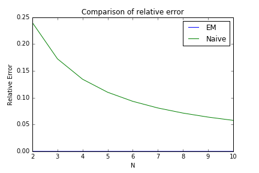
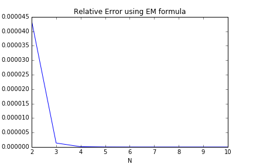

# The Euler Maclaurin Formula

The Euler-Maclaurin formula describes a relationship between sums and integrals. Specifically, it relates
$$
\sum_{n=a}^b f(n) = \int_a^b f(t)dt    +   ?
$$
The formula was discovered by both Euler and Maclaurin in the 1800s. They discovered it independently of each other. 

# Background

First, I'll introduce the Bernoulli numbers and then some basic ideas about differential operators. Using these results a very 'rock and roll' derivation of the Euler-Maclaurin formula follows. 

Most of this derivation is setup, so let's begin. 

## The Bernoulli numbers

The first few Bernoulli numbers are

$B_0 = 1, B_1 = -\frac{1}{2}, B_2 = \frac{1}{6}, B_3 = 0,B_4 = \frac{-1}{30},B_5 = 0,B_6=\frac{1}{42},B_7 = 0,B_8=\frac{-1}{30},B_9 = 0,B_{10}=\frac{5}{66}$ 

The odd $b_i$ are zero for $i \neq 1$ . At first glance these numbers seem pretty unpredictable. However, they are given by the coefficients of the following power series expansion
$$
\frac{x}{e^x-1} = \sum_{i=0}^\infty B_n \frac{x^n}{n!}
\label{bern}
$$
We can't spend too much time on these numbers as they would be a lecture in themselves. However, I'll briefly give one method in which they can be derived. 

It is difficult to compute the expansion of $\eqref{bern}$ however it is easy to compute the expansion of it's reciprocal
$$
\frac{e^x-1}{x} =\frac{1}{x} \sum_{n=1}^\infty \frac{x^n}{n!}  = \sum_{n=0}^\infty \frac{x^n}{(n+1)!} = 1 + \frac{x}{2} + \frac{x^2}{6} \dots
$$
And then 
$$
1 = \left(\frac{x}{e^x-1}\right) \left(\frac{e^x-1}{x}  \right) = \left(1 + \frac{x}{2} + \frac{x^2}{6} \right)\left(B_0 + \frac{B_1}{1!}x + \frac{B_2}{2!}x^2 \right)
$$
Then by collecting the coefficients of powers of $x$ one can find the Bernoulli numbers recursively. 

For the rest of this lecture, we'll take for granted that we have $B_i$ available to us. 

## The Differential Operator

For now let's assume we have some function $f$ that is infinitely differentiable. Then 
$$
f'(x) = \frac{d}{dx} f(x)
$$
and we can regard the operation $\frac{d}{dx}$ as a function valued function which we will call $D$. 
$$
D := \frac{d}{dx}
$$
It is natural to define the $n$-th 'power' of $D$ to be the $n$-th derivative operator. For example
$$
D^2 f(x) = D (D(f(x))) = \frac{d^2f(x)}{dx^2} = f''(x)
$$
Generally 
$$
D^n f(x) = f^{(n)}(x)
$$

Now, let's take another function $g$ that can be decomposed into a power series (Eventually we will want to take $g$ to be the same function as we use to define the Bernoulli numbers). We have 
$$
g(x) = \sum_{n=0}^\infty a_n x^n
$$
Then, plugging in $D$ to $g$ we get
$$
g(D) = \sum_{n=0}^\infty a_n D^n
$$

If we take $g$ to be the exponential function we get an important result so we name this result. 
$$
E := \exp(D) = \sum_{n=0}^\infty \frac{D^n}{n!}
$$
And applying $E$ to $f$
$$
E f(x) = \sum_{n=0}^\infty \frac{1}{n!} D^n f(x) = \sum_{n=0}^\infty \frac{1}{n!} \frac{d^n f(x)}{dx^n}
$$
which we can recognize as the Taylor series of $f(x+1)$. From this we can see that
$$
E f(x) = f(x+1)
$$
**That is incredible!**. Repeated application of the above shows that this generalizes to 
$$
E^s f(x) = f(x+s)
$$

# The Derivation

#### Lemma 1

For any infinitely differentiable function $f$ 
$$
\sum_{n=0}^\infty f(x + n) = \int_x^\infty f(s)ds + \frac{1}{2}f(x) - \sum_{n=2}^\infty \frac{B_n}{n!} \frac{d^{n-1} f(x)}{dx^{n-1}}
$$

##### Proof

$$
\begin{split}
\sum_{n=0}^\infty f(x + n) & = f(x) + f(x+1) + \dots = f(x) + E f(x) + E^2 f(x) + \dots
\\
& = (E^0 + E^1 + E^2 + \dots)f(x) = \frac{1}{1 - E}f(x) 
\\
& = \frac{1}{1 - e^D}f(x) 
\end{split}
$$

Where in the last step we applied the geometric series formula with absolutely no regard as what it would mean to say $|E| < 1$

Then, without thinking too hard about if we can treat $D$ as a variable we apply the power series associated with the Bernoulli numbers
$$
\begin{split}
\frac{1}{1 - e^D} & = \frac{-1}{D} \frac{D}{e^D - 1} = \frac{-1}{D} \sum_{i=0}^\infty B_n \frac{D^n}{n!}
\\
& = \frac{-1}{D} (1 - \frac{D}{2} - \sum_{i=2}^\infty B_n \frac{D^n}{n!})
\end{split}
$$
Finally, we ask what $\frac{1}{D}$ must mean. We would want $\frac{1}{D}D f(x) = f(x)$ and $D$ is a derivative, so we take $\frac{1}{D}$ to be an integral. Thus
$$
\sum_{n=0}^\infty f(x + n) = \frac{1}{1-e^D}f(x) = \int_x^\infty f(s)ds + \frac{1}{2}f(x) - \sum_{n=2}^\infty \frac{B_n}{n!} \frac{d^{n-1} f(x)}{dx^{n-1}}
$$
Using this powerful lemma we can now derive the Euler-Maclaurin formula easily.

## Euler-Maclaurin Formula

##### Theorem

Let $f$ be continuous, infinitely differentiable on $[a,b]$ then the relationship between $\int_a^b f(x)dx$ and the sum $\sum_{n=a}^b f(n)$ is given by 
$$
\sum_{n = a}^b f(n) = \int_{a}^b f(x)dx + \frac{f(b) + f(a)}{2} + \sum_{n=2}^\infty \frac{B_n}{n!} \left[ \frac{d^{n-1} f(x)}{dx^{n-1}} \Big|_b  - \frac{d^{n-1} f(x)}{dx^{n-1}} \Big|_a \right]
$$

##### Proof

This version of the formula is the most useful version. 

Starting with the true LHS of the typical E-M formula we have for general $a,b$ where $b-a \in \mathbb{N}$ 
$$
\begin{split}
\sum_{n = a}^b f(n) & = \sum_{n=a}^\infty f(n) - \sum_{n=b+1}^\infty f(n)
\\
& =  \sum_{n=a}^\infty f(n) - \sum_{n=b}^\infty f(n) + f(b)
\\
& = \sum_{n=0}^\infty f(n + a) - \sum_{n=0}^\infty f(n + b) + f(b)
\\
& = \int_{a}^\infty f(x)dx - \int_{b}^\infty f(x)dx + \frac{1}{2}f(a) - \frac{1}{2}f(b) + f(b)
\\
& - \sum_{n=2}^\infty \frac{B_n}{n!} \frac{d^{n-1} f(x)}{dx^{n-1}} \Big|_a   + \sum_{n=2}^\infty \frac{B_n}{n!} \frac{d^{n-1} f(x)}{dx^{n-1}} \Big|_b   
\\
& = \int_{a}^b f(x)dx + \frac{f(b) + f(a)}{2} + \sum_{n=2}^\infty \frac{B_n}{n!} \left[ \frac{d^{n-1} f(x)}{dx^{n-1}} \Big|_b  - \frac{d^{n-1} f(x)}{dx^{n-1}} \Big|_a \right]
\end{split}
$$

Gross! But also pretty incredible. Since the definition of Riemann Sums from intro calculus we've seen that integrals and sums are related. This E-M formula explicitly shows how they are related. If we like, we could also use the formula to estimate the integral
$$
-\int_{a}^b f(x)dx = -\sum_{n = a}^b f(n) + \frac{f(b) + f(a)}{2} + \sum_{n=2}^\infty \frac{B_n}{n!} \left[ \frac{d^{n-1} f(x)}{dx^{n-1}} \Big|_b  - \frac{d^{n-1} f(x)}{dx^{n-1}} \Big|_a \right]
$$

Hiding in this formula is something that is probably familiar. If we clean up the above a little and ignore that infinite sum on the right we get... the trapezoid rule! Simple enough to be familiar to most intro calc. students.
$$
\begin{split}
-\int_{a}^b f(x)dx & = -\sum_{n = a}^b f(n) + \frac{f(b) + f(a)}{2}
\\
& \iff
\\
\int_{a}^b f(x)dx & = \sum_{n = a}^b f(n) + \frac{f(a) + f(b)}{2}
\\
&= \frac{f(a)}{2} + f(a+1) + ...+f(b-1) + \frac{f(b)}{2}
\end{split}
$$

Now, it might appear that we have just traded a finite sum for an infinite one. On top of that we now also have to compute Bernoulli numbers and derivatives and an integral. However, the Euler-Maclaurin formula really is useful. Most famously, Euler used it to guess at the solution of 
$$
\sum_{n=1}^\infty \frac{1}{n} = \frac{\pi^2}{6}
$$
The EM formula solidified Euler's intuition  that the sum really did equal $\pi/6$ and he went on to prove it shortly after. In the following sections, we'll briefly look at the error if we decide to truncate the sum on the RHS and explore a few applications and examples.

## Error

Practically, in numerical analysis we will never compute an infinite sum. Fortunately, Poisson derived a remainder term for the E-M formula. We won't prove it but the result is 
$$
\sum_{n = a}^b f(n) = \int_{a}^b f(x)dx + \frac{f(b) + f(a)}{2} + \sum_{n=2}^k \frac{B_n}{n!} \left[ \frac{d^{n-1} f(x)}{dx^{n-1}} \Big|_b  - \frac{d^{n-1} f(x)}{dx^{n-1}} \Big|_a \right] + R_k
$$
Where
$$
R_k = \int_a^b \frac{P_n((1-s) - \lfloor1-s\rfloor )}{k!}f^{(k)}(s)ds
$$
and $P_n$ is the $n$-th Bernoulli polynomial
$$
\frac{xe^{xz}}{e^z - 1} = \sum_{n=0}^\infty P_n(x)\frac{z^n}{n!}
$$

###### Divergence

After all the wild assumptions we made about how the operator $D$ worked, we don't get away totally free. The RHS series is not convergent. This stems from the growth of the Bernoulli numbers which grow at a rate roughly
$$
B_{2k} \sim 2\frac{(2k!)}{(2\pi)^{2k}}
$$
Despite this, the Euler-Maclaurin formula is still useful. It is used to interchange between sums and integrals, depending on which one is easier. For example, if the number of terms on the LHS sum is very high, it would be useful to convert this into an integral and a handful of summations from a truncated sum on the RHS. 

In fact, Euler used it for this exact purpose.

# Application

Let's look at how Euler famously used the formula to estimate
$$
\sum_{n=1}^\infty \frac{1}{n^2} = \frac{\pi^2}{6}
$$

First, define the partial sum
$$
S_N = \sum_{n=1}^N \frac{1}{x^2}
$$
Then notice
$$
f^{(n-1)} = n! (-1)^{n-1} x^{-(n+1)}
$$
Thus
$$
\sum_{n=2}^k \frac{B_n}{n!} \left[ \frac{d^{n-1} f(x)}{dx^{n-1}} \Big|_b  - \frac{d^{n-1} f(x)}{dx^{n-1}} \Big|_a \right] = \sum_{n=2}^k B_n (1 - \frac{1}{N^{n+1}})
$$
also

$$
\begin{align}
\int_1^N \frac{1}{x^2} & = 1 - \frac{1}{N}
\\
\frac{f(N) + f(1)}{2} & = \frac{1}{2} + \frac{1}{2N^2}
\end{align}
$$
Plugging this into the EM formula we find
$$
\begin{split}
S_N & = (1 - \frac{1}{N})  + (\frac{1}{2} + \frac{1}{2N^2}) + (\sum_{n=2}^\infty B_n (1 - \frac{1}{N^{n+1}}))
\\
& = \sum_{n=2}^\infty B_n + (-\frac{1}{N} + \frac{1}{2N^2} - \sum_{n=2}^\infty B_n \frac{1}{N^{n+1}})

\end{split}
$$
Letting $N\to \infty$ we actually see
$$
\sum_{N=1}^\infty \frac{1}{n^2} = \sum_{n=2}^\infty B_n
$$
So, we see that 
$$
\begin{split}
S_N & = \sum_{n=2}^\infty B_n + (-\frac{1}{N} + \frac{1}{2N^2} - \sum_{n=2}^\infty B_n \frac{1}{N^{n+1}})
\\
& = \sum_{n=1}^\infty \frac{1}{n^2} + (-\frac{1}{N} + \frac{1}{2N^2} - \sum_{n=2}^\infty B_n \frac{1}{N^{n+1}})
\end{split}
$$
So,
$$
\sum_{n = 1}^\infty \frac{1}{n^2} = S_n + \frac{1}{N} - \frac{1}{2N^2} + \sum_{n=2}^\infty B_n \frac{1}{N^{n+1}})
$$
If we truncate the sum on the RHS, we get a fairly good approximation of the infinite sum. 
$$
\sum_{n = 1}^\infty \frac{1}{n^2} \approx S_n + \frac{1}{N} - \frac{1}{2N^2} + \sum_{n=2}^k B_n \frac{1}{N^{n+1}})
$$

# Python

I've implemented this approximation in python. 

Let's compare

- The above formulation, making use of the Euler-Maclaurin formula
- Naive summation, just calculating the partial sums

Truncating the RHS sum at some value $k$. For the below plots I chose $k = 6$ thus giving $3$ non-zero terms. 

So the comparison is not even close. Let's only focus on the EM formulation so we can see how accurate it gets with only $n = 10$.

The code is available on my [Github](https://github.com/nmarzz/EulerMaclaurinFormula) page.

# References

Mahajan, S., & Carver, A. M. (2010). *Street-fighting mathematics: The art of educated guessing and opportunistic problem 	solving*. Cambridge, MA: MIT Press.

Victor Kač, (2005) *18.704 Seminar in Algebra and Number Theory*. http://people.csail.mit.edu/kuat/courses/euler-maclaurin.pdf

Mathologer, (2019), Youtube, https://www.youtube.com/watch?v=fw1kRz83Fj0&ab_channel=Mathologer